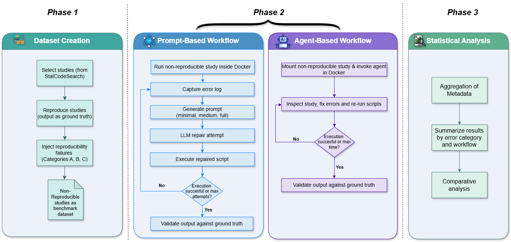

# Automating Computational Reproducibility in Social Science



## Abstract

Reproducing computational research is often assumed to be as simple as re-running the original code with the provided data. In practice, this rarely works. Missing packages, fragile file paths, version conflicts, or incomplete logic frequently cause published analyses to fail, even when authors share all materials. This study asks whether large language models (LLMs) and AI agents can help automate the practical work of diagnosing and repairing such failures, making computational results easier to reproduce and verify.

We evaluate this idea using a controlled reproducibility testbed built from five fully reproducible R-based social science studies. We deliberately injected realistic failures ranging from simple issues to complex missing logic and tested two automated repair workflows in clean Docker environments. The first workflow followed a prompt-based approach, where LLMs were repeatedly queried with structured prompts of varying contextual richness, while the second used agent-based systems that could inspect files, modify code, and re-run analyses inside the environment.

Across prompt-based runs, reproduction success ranged from 31–78%, with performance strongly influenced by prompt context and error complexity. Complex cases benefited most from additional context. Agent-based workflows performed substantially better across all levels of complexity, with success rates ranging from 69–96%. Overall, our results suggest that automated workflows, especially agent-based repair systems, can significantly reduce the manual effort required for computational reproducibility and improve reproduction success across a wide range of error types in research workflows. Unlike prior reproducibility benchmarks that focus on replication from minimal artifacts, our benchmark isolates post-publication repair under controlled failure modes, enabling a direct comparison between prompt-based and agent-based workflows.

## Repository Overview

This repository contains the code and data for research study investigating the use of Large Language Models (LLMs) and AI agents to automate the repair of computational reproducibility failures in R-based scientific code. It features two distinct, self-contained workflows: an **Agent-Based Workflow** and a **Prompt-Based Workflow**, each designed to diagnose and fix common issues encountered when reproducing computational research.

## Repository Structure

The repository is organized into two primary directories, each encapsulating a complete workflow:

```
.
├── prompt-based-workflow/          # Contains the Prompt-Based Reproducibility Workflow
└── agent-based-workflow/           # Contains the Agent-Based Reproducibility Workflow
```

## Workflow 1: Prompt-Based Reproducibility

This workflow implements an automated repair cycle that directly queries LLMs with structured prompts. It uses the research paper and other scripts as context to diagnose and repair R script failures, followed by automated validation.

### 🛠️ Setup

1.  **Navigate and Install Dependencies**:
    ```bash
    cd prompt-based-workflow
    pip install -r requirements.txt
    ```
2.  **Build Docker Images**:
    Two images are required: one for the base R environment and one for the orchestration environment.
    ```bash
    docker build -f Dockerfile.r-image -t r-image .
    docker build -f Dockerfile -t prompt-repro-env .
    ```
3.  **Configure Environment Variables**:
    Create a `.env` file or set the following in your shell:
    -   `OPEN_ROUTER_API_KEY`: Your OpenRouter API key.
    -   `HOST_PROJECT_PATH`: **(Required)** The absolute path to this repository on your *host* machine (e.g., `C:/Users/Name/Automating-Computational-Reproducibility`). This is used for Docker volume mounting.

### ⚙️ Configuration

-   **Model Selection**: Edit `SELECTED_MODEL` in `main.py`. Default is `qwen/qwen3-coder`.
-   **Validation**: Toggle `ENABLE_REPRO_CHECK` and `ENABLE_HALLUCINATION_CHECK` in `main.py` to enable/disable automated verification.

### 🚀 Usage

Run the `main.py` script on a specific error folder:

```bash
# Example: Run on Sample 1, Easy Error 101 with full context
python main.py sample1/easy/error_101_wrong-path --mode full
```

-   **Modes**: 
    -   `minimal`: Only provides the error log and the broken script.
    -   `medium`: Adds the research paper (`paper.md`) as context.
    -   `full`: Adds the paper and other related R scripts from the same study.

### 📊 Output & Analysis

-   **`run_summary.csv`**: Created in the sample's directory (e.g., `sample1/run_summary.csv`) with detailed metrics for each run.
-   **`Categories.csv`**: Global log for all executions.
-   **`paper_vs_results_summary.txt`**: Detailed LLM-generated comparison between the script's output and the findings in the research paper.

### Directory Structure

The `prompt-based-workflow/` directory contains:

```
prompt-based-workflow/
├── __pycache__/
├── .gitattributes
├── .gitignore
├── Categories.csv                  # Results log for this workflow
├── config.py                       # Configuration settings for the workflow
├── docker-compose.yml              # Docker Compose file for environment setup
├── Dockerfile                      # Main Dockerfile for the prompt-based environment
├── Dockerfile.r-image              # Dockerfile for the R execution environment
├── error_fix.py                    # LLM-based script fixer engine
├── hallucination_check.py          # Script for checking LLM output against the original script results
├── main.py                         # Main orchestrator script for this workflow
├── pdftomd.py                      # Utility for PDF to Markdown conversion
├── reproducibility_check.py        # Script for verifying scientific claims against the paper
├── requirements.txt                # Python dependencies for this workflow
└── samples                         # Test cases for this workflow (sample1-5)
```

### How It Works

Orchestrated by `main.py`, this workflow operates within an isolated Docker environment defined by `Dockerfile` and `Dockerfile.r-image`. When an R script fails, the system gathers the broken code, error logs, and contextual intent (from `paper.md`). It then constructs a structured prompt for an LLM (e.g., Qwen-Coder, GPT-4o) to generate a fix. After patching the code, it re-executes and proceeds to validate the results using `hallucination_check.py` and `reproducibility_check.py`.

## Workflow 2: Agent-Based Reproducibility

This workflow employs autonomous AI agents (e.g., Claude, OpenCode, or Gemini) to interactively diagnose, modify, and re-run R scripts within a Dockerized environment. Unlike the prompt-based approach, agents can explore the filesystem and iteratively fix errors based on real-time feedback.

### 🛠️ Setup

1.  **Navigate and Install Dependencies**:
    ```bash
    cd agent-based-workflow/
    # The orchestrator requires python-dotenv
    pip install -r requirements.txt 
    ```
2.  **Build the Agent Environment**:
    The orchestration script expects a docker image. Build it using:
    ```bash
    docker build -t my-agent-base:latest .
    ```
3.  **Configure API Keys**:
    Ensure `OPENROUTER_API_KEY` is set in your environment or a `.env` file.

### ⚙️ Configuration (Model Selection)

You can customize which LLM the agents use by editing the configuration files, by default, it uses `qwen/qwen3-coder`:
-   **OpenCode Agent**: Edit `opencode_config/opencode.json`..
-   **Claude Agent**: Edit `claude_code_router_config/config.json`.

### 🚀 Usage

The `run.py` script orchestrates the execution, `--agent` is used to switch between opencode or claude. You can run it on a single sample or in batch mode using `--single` or `--batch` argument:

```bash
# Run on a single error case (Example: Sample 1, Easy Error 101) using opencode
python run.py --single sample1/easy/error_101_wrong-path --agent opencode

# Run in batch mode on all 'sample' folders within a sample3 using claude
python run.py --batch sample3 --agent claude
```

### 📊 Output & Results
The agent will attempt to fix the code and perform a reproducibility check against the paper.
- **`Categories.csv`**: A global log updated with execution metrics, model used, and success status.

### Directory Structure

The `agent-based-workflow/` directory contains:

```
agent-based-workflow/
├── Categories.csv                  # Results log for this workflow
├── Dockerfile                      # Docker image definition for the agent environment
├── log_parser.py                   # Utility to parse agent logs
├── prompt.txt                      # The core prompt guiding the agent's behavior
├── run.py                          # Main script to orchestrate agent runs
├── claude_code_router_config/      # Configuration for claude agent 
├── opencode_config/                # Configuration for the opencode agent 
└── samples                         # Test cases for this workflow (sample 1-5)
    ├── sample1/
    │   ├── base/                   # Reference output for sample1
    │   └── ... (error_XXX folders with R scripts, data, paper.md)
    └── ... (sample2-5 structured similarly)
```

### How It Works

The `run.py` script acts as the orchestrator. It sets up a Docker container based on `Dockerfile`, which includes an R environment and necessary agent CLI tools. It then leverages an AI agent ( OpenCode, or Claude agent) to attempt to reproduce R scripts from the `samples/` directory. The agent follows instructions in `prompt.txt` to identify errors, apply minimal fixes, and report the reproducibility status (`status.txt`).

---