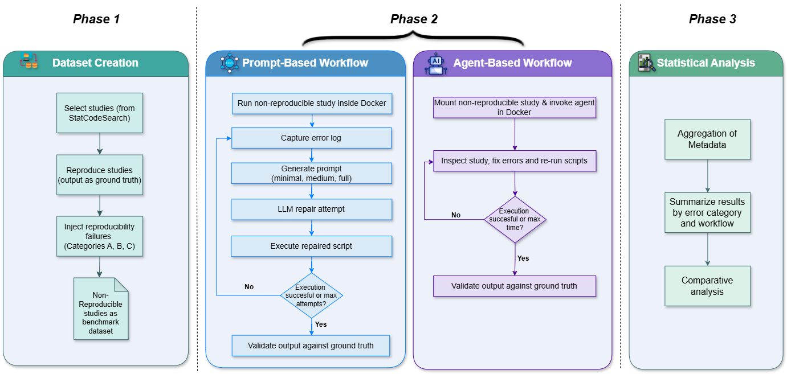

# Automating Computational Reproducibility in Social Science



## Abstract

Reproducing computational research is often treated as a straightforward matter of re-running shared code on shared data. In practice, published analyses frequently fail even when materials are available, due to missing dependencies, brittle paths, version mismatches, and—more challenging—gaps in analytical logic. We investigate whether large language models (LLMs) and autonomous AI agents can automate the routine but labor-intensive work of repairing such failures, thereby lowering the practical barrier to computational verification.

We evaluate two automated repair paradigms in a controlled setting derived from five fully reproducible R-based social science studies. Starting from ground-truth executions, we inject realistic failure modes spanning execution-level issues, contextual code fixes, and structural logic omissions, and package them into 130 synthetic test cases. These test cases were systematically categorized based on the complexity and diversity of the injected errors. We then run (i) a prompt-based workflow that iteratively queries LLMs with structured prompts at increasing levels of contextual richness, and (ii) an agent-based workflow in which coding agents inspect project files, apply targeted edits, and re-run analyses until completion or a time limit. Repairs are only counted as successful if the resulting outputs match the ground-truth outputs, not merely if the code executes.

Across prompt-based runs, reproduction success varies substantially (31–79%), shaped by both failure complexity and the amount of context provided; richer context yields the largest gains on structurally complex cases. Agent-based workflows consistently achieve higher success (69–96%) across all categories, suggesting that environment-aware, iterative tool use provides a decisive advantage over API-only prompting. By isolating post-publication repair under controlled, systematic failure modes, our benchmark enables direct comparisons between prompt-based and agentic workflows and provides evidence that agentic repair systems can meaningfully reduce manual labour while improving the reliability of computational reproducibility in realistic research pipelines.

## Repository Overview

This repository contains the code and data for research study investigating the use of Large Language Models (LLMs) and AI agents to automate the repair of computational reproducibility failures in R-based scientific code. It features two distinct, self-contained workflows: an **Agent-Based Workflow** and a **Prompt-Based Workflow**, each designed to diagnose and fix common issues encountered when reproducing computational research in social science.

## Repository Structure

The repository is organized into two primary directories, each encapsulating a complete workflow:

```
.
├── prompt-based-workflow/          # Contains the Prompt-Based Reproducibility Workflow
└── agent-based-workflow/           # Contains the Agent-Based Reproducibility Workflow
```

## Workflow 1: Prompt-Based Reproducibility

This workflow implements an automated repair cycle that directly queries LLMs with structured prompts. It uses the research paper and other scripts as context to diagnose and repair R script failures, followed by automated validation.

### 🛠️ Setup

1.  **Prepare the Data**:
    Copy the `sample1`, `sample2`, `sample3`, `sample4`, and `sample5` folders from the root `benchmark-dataset/` directory into the `prompt-based-workflow/` directory.
2.  **Navigate and Install Dependencies**:
    ```bash
    cd prompt-based-workflow
    pip install -r requirements.txt
    ```
3.  **Build Docker Images**:
    Two images are required: one for the base R environment and one for the orchestration environment.
    ```bash
    docker build -f Dockerfile.r-image -t r-image .
    docker-compose build manager
    ```
4.  **Configure Environment Variables**:
    Create a `.env` file or set the following in your shell:
    -   `API_KEY`: Your OpenAI-compatible API key.
    -   `HOST_PROJECT_PATH`: **(Required)** The absolute path to this repository on your *host* machine (e.g., ` C:/User/Automating-Computational-Reproducibility/prompt-based-workflow`). This is used for Docker volume mounting.

### ⚙️ Configuration

-   **Model Selection**: Edit `SELECTED_MODEL` in `main.py`. Default is `qwen/qwen3-coder`.

### 🚀 Usage

Use `docker-compose run` to execute the `main.py` script inside the `manager` container. The arguments to `main.py` are passed at the end of the command.

To avoid warnings about "orphan containers" and to keep your system clean, it is highly recommended to use the `--rm` flag. This will automatically remove the container after the experiment is finished.

```bash
docker-compose run --rm manager python main.py [paths...] [--mode MODE]
```

Run the `main.py` script on a specific error sample:

```bash
# Example: Run on Sample 1, easy error 101 with full prompt
docker-compose run --rm manager python main.py sample1/easy/error_101_wrong-path --mode full
```

Run the `main.py` script on a batch of samples:

```bash
# Example: Run on Sample 3, all easy errors with minimal prompt
docker-compose run --rm manager python main.py sample3/easy --mode minimal
```

-   **Modes**: 
    -   `minimal`: Only provides the error log and the broken script.
    -   `medium`: Adds the research paper (`paper.md`) as context.
    -   `full`: Adds the paper and other related R scripts from the same study.

### 📊 Output & Analysis

-   **`run_summary.csv`**: Created in the sample's directory (e.g., `sample1/run_summary.csv`) with detailed metrics for each run.
-   **`Categories.csv`**: Global log for all executions.

### Directory Structure

The `prompt-based-workflow/` directory contains:

```
prompt-based-workflow/
├── __pycache__/
├── .gitattributes
├── .gitignore
├── Categories.csv                  # Results log for this workflow
├── config.py                       # Configuration settings for the workflow
├── docker-compose.yml              # Docker Compose file for environment setup
├── Dockerfile                      # Main Dockerfile for the prompt-based environment
├── Dockerfile.r-image              # Dockerfile for the R execution environment
├── error_fix.py                    # LLM-based script fixer engine
├── hallucination_check.py          # Script for checking LLM output against the original script results
├── main.py                         # Main orchestrator script for this workflow
├── pdftomd.py                      # Utility for PDF to Markdown conversion
├── reproducibility_check.py        # Script for verifying scientific claims against the paper
├── requirements.txt                # Python dependencies for this workflow
└── samples                         # Test cases for this workflow (sample 1-5)
    ├── sample1/
    │   ├── base/                   # Reference output for sample1
    │   └── ... (error_XXX folders with R scripts, data, paper.md)
    └── ... (sample2-5 structured similarly)
```

### How It Works

Orchestrated by `main.py`, this workflow operates within an isolated Docker environment defined by `Dockerfile` and `Dockerfile.r-image`. When an R script fails, the system gathers the broken code, error logs, and contextual intent (from `paper.md`). It then constructs a structured prompt for an LLM (e.g., Qwen-Coder, GPT-4o) to generate a fix. After patching the code, it re-executes and proceeds to validate the results using `hallucination_check.py` and `reproducibility_check.py`.

## Workflow 2: Agent-Based Reproducibility

This workflow employs autonomous AI agents (e.g., Claude, OpenCode) to interactively diagnose, modify, and re-run R scripts within a Dockerized environment. Unlike the prompt-based approach, agents can explore the filesystem and iteratively fix errors based on real-time feedback.

### 🛠️ Setup

1.  **Prepare the Data**:
    Copy the `sample1`, `sample2`, `sample3`, `sample4`, and `sample5` folders from the root `benchmark-dataset/` directory into the `agent-based-workflow/` directory.
2.  **Navigate and Install Dependencies**:
    ```bash
    cd agent-based-workflow
    pip install -r requirements.txt 
    ```
3.  **Build the Agent Environment**:
    The orchestration script expects a docker image. Build it using:
    ```bash
    docker build -t my-agent-base:latest .
    ```
4.  **Configure API Keys**:
    Ensure OpenAI-compatible `API_KEY` is set in your environment or a `.env` file.

### ⚙️ Configuration (Model Selection)

You can customize which LLM the agents use by editing the configuration files, by default, it uses `qwen/qwen3-coder`:
-   **OpenCode Agent**: Edit `opencode_config/opencode.json`..
-   **Claude Agent**: Edit `claude_code_router_config/config.json`.

### 🚀 Usage

The `run.py` script orchestrates the execution, `--agent` is used to switch between opencode or claude. You can run it on a single sample or in batch mode using `--single` or `--batch` argument:

```bash
# Run on a single error case (Example: Sample 1, Easy Error 101) using opencode
python run.py --single sample1/easy/error_101_wrong-path --agent opencode

# Run in batch mode on all 'sample' folders within a sample3 using claude
python run.py --batch sample3 --agent claude
```

### 📊 Output & Results
The agent will attempt to fix the code and perform a reproducibility check against the paper.
- **`Categories.csv`**: A global log updated with execution metrics, model used, and success status.

### Directory Structure

The `agent-based-workflow/` directory contains:

```
agent-based-workflow/
├── Categories.csv                  # Results log for this workflow
├── Dockerfile                      # Docker image definition for the agent environment
├── log_parser.py                   # Utility to parse agent logs
├── prompt.txt                      # The core prompt guiding the agent's behavior
├── run.py                          # Main script to orchestrate agent runs
├── claude_code_router_config/      # Configuration for claude agent 
├── opencode_config/                # Configuration for the opencode agent 
└── samples                         # Test cases for this workflow (sample 1-5)
    ├── sample1/
    │   ├── base/                   # Reference output for sample1
    │   └── ... (error_XXX folders with R scripts, data, paper.md)
    └── ... (sample2-5 structured similarly)
```

### How It Works

The `run.py` script acts as the orchestrator. It sets up a Docker container based on `Dockerfile`, which includes an R environment and necessary agent CLI tools. It then leverages an AI agent ( OpenCode, or Claude agent) to attempt to reproduce R scripts from the `samples/` directory. The agent follows instructions in `prompt.txt` to identify errors, apply minimal fixes, and report the reproducibility status (`status.txt`).

----

## Citation

If you find this work or the benchmark dataset useful for your research, please cite our paper:

**Shah, S. M. H., Hopfgartner, F., & Bleier, A. (2026). Automating Computational Reproducibility in Social Science: Comparing Prompt-Based and Agent-Based Approaches.** *arXiv preprint arXiv:2602.08561*. 
[https://doi.org/10.48550/arXiv.2602.08561](https://doi.org/10.48550/arXiv.2602.08561)

----

This work was supported by the German Research Foundation (DFG), project nos. 551687338 and 460234259.